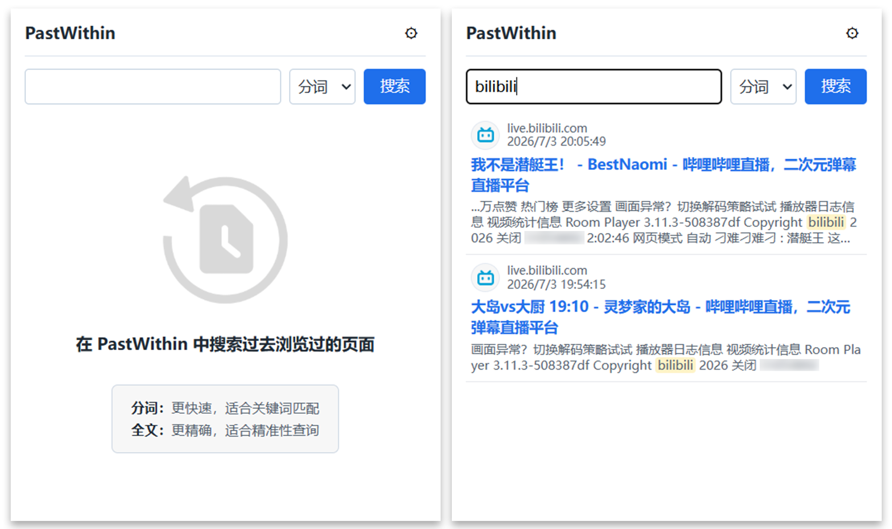

# PastWithin

English | [Simplified Chinese](README.md)

A lightweight, local-first Chrome history search extension for saving full text from pages you have browsed and finding them later with token search or exact full-text search.

<p align="center">
  
</p>

## Features

- **Automatic capture**: saves page title, URL, full text, visit time, and bookmark status while browsing.
- **Local storage**: stores all data locally in IndexedDB and does not upload it to a remote service.
- **Two search modes**:
  - **Token search**: fast indexed search based on word segmentation. This is the default mode.
  - **Full-text search**: exact matching against saved page text, suitable for continuous snippets, errors, and code fragments.
- **Search progress and stop**: full-text search reports scan progress and can be stopped from the popup.
- **Highlighting**: search results show matching snippets and highlighted terms.
- **URL exclusions**: excludes sensitive or noisy pages with regular-expression rules.
- **Storage statistics**: shows local storage usage and saved page counts.
- **Data management**: supports clearing local data and clearing saved full text.

## Tech Stack

- Chrome Manifest V3
- Plasmo
- React + TypeScript
- Dexie (IndexedDB)
- Vitest

## Install and Build

```bash
# Install dependencies
npm install

# Development mode
npm run dev

# Production build
npm run build
```

The production build is generated in `build/chrome-mv3-prod/`. Load this directory in Chrome's extension management page to use the extension.

### Manually Load in Chrome

1. Download `PastWithin-v0.2.0-chrome-mv3.zip` and extract it into a `PastWithin` directory.
2. Open Chrome and go to `chrome://extensions/`.
3. Enable "Developer mode" in the top-right corner.
4. Click "Load unpacked".
5. Select the extracted `PastWithin` directory.
6. After loading, browse ordinary pages to trigger capture, then click the PastWithin toolbar icon to search.

## Testing

```bash
# Run tests
npm test

# Watch mode
npm run test:watch

# Coverage report
npx vitest run --coverage
```

Test contracts and module conventions are documented in `tests/README.md`.

## Project Structure

```text
.
├── background/          # Background service: db, search, capturePipeline
├── contents/            # Content script: pageCapture
├── popup/               # Popup search entry
├── options/             # Options page
├── lib/                 # Shared utilities
├── tests/               # Test files
├── docs/                # Project documentation
└── assets/              # Static assets
```

See `docs/architecture.md` for detailed architecture notes.

## Documentation

- `docs/architecture.md` - Architecture and design decisions
- `docs/implementation-plan.md` - Planned improvements
- `docs/manual-test.md` - Manual acceptance checklist
- `tests/README.md` - Test contracts and commands

## Permissions

The extension requests the following permissions:

- `storage`: stores settings.
- `bookmarks`: checks page bookmark status.
- `tabs`: reads tab information.
- `favicon`: displays site icons in search results.
- `host_permissions`: runs the content script on ordinary web pages.

All data is stored locally by default. The extension does not request remote API permissions.

## License

See `LICENSE`.
